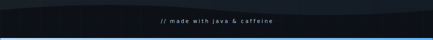

<div align="center">



</div>

<br/>

```yaml
# qweyns.yml

name:    qweyns
lang:    Java 17+
stack:   [ Spigot, Paper, Bukkit ]
focus:   server-side mechanics — spawners, holograms, mascots, custom systems
status:  on vacation 🌴
```

<br/>

---

```yaml
# plugins

WoolyHideJoinQuiet:   hides player join / quit messages
SmashEgg:             spawner mechanics
RussianTimeExpansion: russian time format in Small Caps style
PSHologramm:          hologram addon
QweMascots:           spheres & mascots system
```

---

<div align="center">


</div>

---

<div align="center">

[](https://t.me/nyawexi)
[](https://discord.com/users/qweyns.exp)
[](https://guns.lol/qweyns)

</div>

<br/>

<div align="center">



</div>
